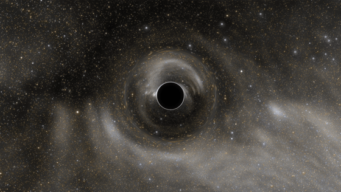
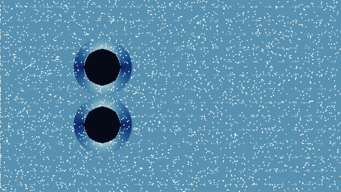
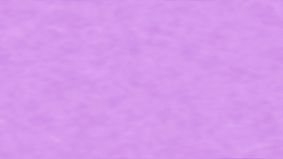
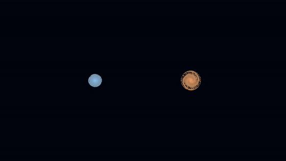
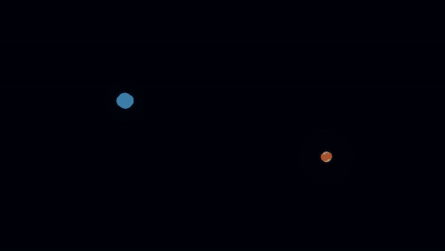
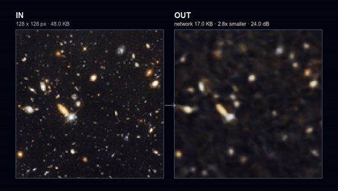
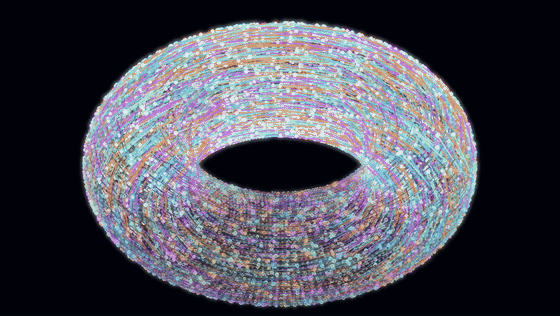
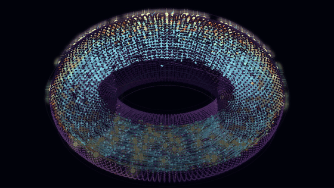

# Leonardo Visual Demos

A portable gallery of 13 visual high-performance computing demonstrations for public engagement. Each demo separates headless scientific computation from presentation: the solver writes numbered frames and metadata, while a lightweight web viewer handles playback, controls, readouts, and saved runs.

The previews below were generated with the `desktop` profile using **150 simulation frames per demo**. Array solvers used CuPy/CUDA where supported, neural demos used PyTorch/CUDA, and CPU-native demos used NumPy.

## Demo gallery

### Black-hole lensing

Image-space gravitational lensing with a numerical 3D photon-path view.



### Primordial black-hole threshold

A reduced radial model exploring the boundary between collapse and dispersion.


### Virtual wind tunnel

D2Q9 lattice-Boltzmann flow with advected streaklines and configurable obstacles.



### Cosmic-web formation

Particle-mesh gravity with expanding-space and gas-composition comparisons.



### Milky Way–Andromeda collision

Restricted N-body evolution using physical mass and encounter parameters.



### Galaxy collision: full 3D gravity

Direct softened all-pairs gravity over massive disc, bulge, and halo particles.



### Living mathematics

Gray–Scott reaction-diffusion evolving from a seed into an emergent pattern.


### Crystal growth

Recursive anisotropic growth with multiple habits and effectively unbounded deep zoom.


### Neural-network wall

A real batched coordinate-network training workload that reveals many networks at once.



### Star in a Bottle

A reduced nonlinear plasma-wave lattice projected onto a rotatable tokamak torus,
in two selectable modes. *Passive confinement* advects tracers through the drift
the field produces. *AI plasma guardian* hands the coils to a neural policy
trained through virtual plasma shots, fills the torus with confined markers, and
sparks the ones the policy fails to hold against the wall.





### Storm Factory

A barotropic-vorticity atmosphere turns small initial uncertainty into diverging forecasts.


### Molecular Machine

Coarse-grained 3D molecular dynamics with all-pairs interactions and ensemble comparisons.


The same demo contract runs locally, on a CUDA desktop, or headlessly under SLURM on Leonardo. Completed runs can be replayed without recomputation.

## Run locally

Python 3.10 or newer is required.

```bash
python -m venv .venv
# Windows: .venv\Scripts\activate
# macOS/Linux: source .venv/bin/activate
pip install -r requirements.txt
python app.py
```

Open the address printed by the server, normally `http://127.0.0.1:8000`. On Windows, `Run_Leonardo_Demos.bat` provides a simple demo menu.

For a public stand, open `http://127.0.0.1:8000/demo` instead: a stripped-back
walk-up viewer with large controls, the explanation printed under the picture
and every advanced setting behind one presenter panel. See
[docs/DEMO_MODE.md](docs/DEMO_MODE.md).

To generate an individual run directly:

```bash
python run_demo.py reaction_diffusion --profile desktop --frames 150
```

## Recreate this showcase

The showcase command is resumable: complete runs are reused and missing or incomplete demos are rendered again. GIF creation requires `ffmpeg` on `PATH`.

```bash
python scripts/generate_showcase.py
```

Raw runs are stored under `runs/showcase_desktop_150/`; the README-ready animations are written to `docs/assets/demos/`. Use `--demo DEMO_ID` to process one demo or `--force` to rerender completed runs.

## Leonardo workflow

Leonardo jobs run headlessly through the templates in `slurm/`; generated frames and metadata are then synchronised to the presentation machine for live playback or a clearly labelled saved-run fallback. Start with [the Leonardo guide](docs/LEONARDO.md), then use the included preflight, submission, and sync scripts.

## Discoverer workflow

The Brain++ Discoverer B200/NVL72 setup is documented separately because its
ARM64 GPU nodes, CUDA 13 user-space environment, storage policy, and Slurm
allocation differ from Leonardo. Use the [Discoverer runbook](docs/DISCOVERER.md)
and its GPU smoke test before submitting a production run.

## Precision and GPU kernels

The 3-D galaxy collision, 2-D galaxy collision, and wind tunnel accept
`--precision fp32|fp64` (plus `mixed` for the 3-D N-body) and use hand-written
CUDA kernels whose launch shapes are autotuned on the GPU running the job.
[The performance guide](docs/PERFORMANCE.md) explains the modes, hardware
trade-offs, benchmark tool, and accuracy-testing tools.

These are public-engagement demonstrators rather than production research solvers. Model assumptions and limitations are documented in [the scientific notes](docs/SCIENTIFIC_NOTES.md), with per-demo detail under [`docs/demos/`](docs/demos/README.md).
