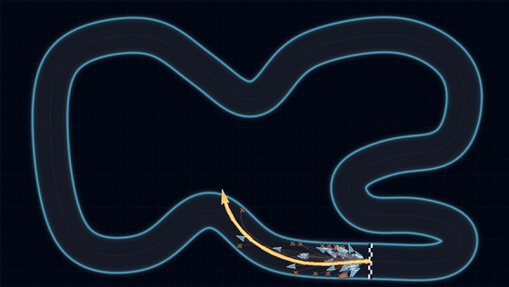
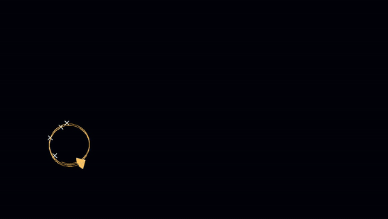

# Leonardo Visual Demos

A portable gallery of visual high-performance computing demonstrations for public engagement. Each demo separates headless scientific computation from presentation: the solver writes numbered frames and metadata, while a lightweight web viewer handles playback, controls, readouts, and saved runs.

## On the stand

These are the nine demos presented on demo day, in the order the walk-up viewer at `/demo` shows them. Every animation below is cut from one of that demo's curated **showcase runs**: the large renders made ahead of time on the Brain++ Discoverer GB200 nodes and on a CUDA desktop, which the stand replays when nobody is at the controls.

### 1 · Star in a Bottle — fusion

A fusion plasma held by magnetic fields inside a torus-shaped vessel: a nonlinear plasma-wave lattice projected onto a rotatable tokamak.
*Passive confinement* (left) advects tracers through the drift the field produces.
*AI plasma guardian* (right) hands the coils to a neural policy trained shot by shot, fills the torus with confined markers, and sparks the ones it fails to hold off the wall.

 

<sub>Discoverer GB200 · 24,000 lattice steps, 6,000 tracers (passive) · 12 training shots with 16 parallel plasmas (guardian)</sub>

### 2 · Neuro-Racers — AI

Visitors build a car brain from blocks; thousands of cars share it, each with different random weights, and the best drivers of every generation become the parents of the next. Nobody programs the driving.



<sub>Desktop RTX 3060 Ti · 4,096 cars × 150 generations on the Grand Prix track, then 16 independent searches</sub>

### 3 · Bat vs Moth — AI

One visitor builds a bat that hunts by sonar, another a moth that learns to jam it, and the two co-evolve in a dark cave.



<sub>Desktop RTX 3060 Ti · population of 8,192 × 300 generations; jamming evolved at generation 131</sub>

### 4 · Milky Way meets Andromeda — full 3D gravity

Direct softened all-pairs gravity: every massive disc, bulge and halo particle pulls on every other one, in three dimensions. Seeded from Gaia DR3 and PHAT data; illustrative, not a fitted prediction.


<sub>Discoverer GB200 · 2,000,000 particles over 8 billion years</sub>

### 5 · Neural image compression — AI

A neural network learns to redraw a picture from nothing but pixel coordinates. Its weights become the compressed file: smaller than the picture, at the cost of some detail. Visitors can draw, upload or photograph their own picture.


<sub>Desktop RTX 3060 Ti · 64 networks trained at once on the Hubble Deep Field (the clip shows the first stretch of training)</sub>

### 6 · Black hole — Gaia sky

A camera beside a real black hole found by the Gaia satellite, looking at the real sky of 1.8 million Gaia stars through the hole's gravity, with exact photon orbits.


<sub>Desktop CPU · 2560×1440, 2× supersampled: 14.7 million exact photon orbits per frame</sub>

### 7 · Virtual wind tunnel

Air flowing past an obstacle in a D2Q9 lattice-Boltzmann tunnel, with advected streaklines. Visitors can draw their own obstacle and watch its wake go turbulent.


<sub>Discoverer GB200 · 5120×2880 lattice, 170,000 steps</sub>

### 8 · Cosmic web

An almost-smooth young universe in which gravity grows tiny differences into clusters, filaments and voids. Change the "recipe of the universe" and see whether a web can form at all.


<sub>Desktop RTX 3060 Ti · 10.5 million particles on a 2048² particle-mesh grid (warm-dark-matter recipe)</sub>

### 9 · Milky Way–Andromeda — restricted N-body

Our actual future: the two galaxies meet, and gravity pulls out long tidal tails of stars.


<sub>Desktop RTX 3060 Ti · 1,000,000 stars over 8 billion years</sub>

The full dashboard at `/` also carries the other demos (primordial black holes, reaction-diffusion, crystal growth, the storm ensemble and molecular dynamics); see [`docs/demos/`](docs/demos/README.md).

**MUrB N-body** runs the external [NBody-EuroHPC](https://github.com/albtad01/NBody-EuroHPC) C++/CUDA code from the dashboard and draws it the way its own viewer does; setup in [docs/NBODY_MURB.md](docs/NBODY_MURB.md). Pre-recorded videos placed in `videos/` play on the **Videos** page (`/videos`).

The same demo contract runs locally, on a CUDA desktop, or headlessly under SLURM on Leonardo. Completed runs can be replayed without recomputation.

## Run locally

Python 3.10 or newer is required.

```bash
python -m venv .venv
# Windows: .venv\Scripts\activate
# macOS/Linux: source .venv/bin/activate
pip install -r requirements.txt
python app.py
```

Open the address printed by the server, normally `http://127.0.0.1:8000`. On Windows, `Run_Leonardo_Demos.bat` provides a simple demo menu.

For a public stand, open `http://127.0.0.1:8000/demo` instead: a stripped-back
walk-up viewer with large controls, the explanation printed under the picture
and every advanced setting behind one presenter panel. See
[docs/DEMO_MODE.md](docs/DEMO_MODE.md).

Both pages show the lineup of the active **demo day** (Discoverer or Leonardo),
and either can send a run to Discoverer or Leonardo and play the result when it
comes back. See [docs/CLUSTER_RUNS.md](docs/CLUSTER_RUNS.md).

To generate an individual run directly:

```bash
python run_demo.py reaction_diffusion --profile desktop --frames 150
```

## Demo day

Setting up a laptop as the machine that runs the stand, from nothing:
[docs/DEMO_DAY_SETUP.md](docs/DEMO_DAY_SETUP.md). It covers what git does not
carry (the saved runs, the videos and the Gaia sky), the two-display
arrangement, and the checklist for the morning.

## Carry saved runs to another machine

`runs/` is not in git (a showcase run can be gigabytes of frames). To move the
runs worth keeping (every starred run, every showcase pick and every run made
on Discoverer or Leonardo), pack them into one zip:

```bash
python tools/export_runs.py
```

On Windows, double-click `Export_Saved_Runs.bat`. The zip lands in `exports/`
(`--list` previews the selection; `--run RUN_ID` adds more). Copy it by Google
Drive or USB, put it in `runs/_import/` (or the project root) on the other
machine, and start the viewer: the runs are unpacked in the background and the
stars and showcase picks come with them. Runs that already exist are never
overwritten, and a zip is only imported once, so it can be deleted afterwards.

## Recreate the README animations

The GIFs above are cut from saved showcase runs, so nothing is re-simulated; this needs those runs in `runs/` (see above) and `ffmpeg` on `PATH`.

```bash
python scripts/make_readme_gifs.py            # every GIF
python scripts/make_readme_gifs.py fluid      # one of them
```

Which run, and which stretch of it, each GIF uses is the `CLIPS` table at the top of the script. To render fresh, smaller runs of every demo from scratch instead, `python scripts/generate_showcase.py` still works (resumable; `--demo DEMO_ID`, `--force`).

## Leonardo workflow

Leonardo jobs run headlessly through the templates in `slurm/`; generated frames and metadata are then synchronised to the presentation machine for live playback or a clearly labelled saved-run fallback. Start with [the Leonardo guide](docs/LEONARDO.md), then use the included preflight, submission, and sync scripts.

## Discoverer workflow

The Brain++ Discoverer B200/NVL72 setup is documented separately because its
ARM64 GPU nodes, CUDA 13 user-space environment, storage policy, and Slurm
allocation differ from Leonardo. Use the [Discoverer runbook](docs/DISCOVERER.md)
and its GPU smoke test before submitting a production run.

## Precision and GPU kernels

The 3-D galaxy collision, 2-D galaxy collision, and wind tunnel accept
`--precision fp32|fp64` (plus `mixed` for the 3-D N-body) and use hand-written
CUDA kernels whose launch shapes are autotuned on the GPU running the job.
[The performance guide](docs/PERFORMANCE.md) explains the modes, hardware
trade-offs, benchmark tool, and accuracy-testing tools.

These are public-engagement demonstrators rather than production research solvers. Model assumptions and limitations are documented in [the scientific notes](docs/SCIENTIFIC_NOTES.md), with per-demo detail under [`docs/demos/`](docs/demos/README.md).
